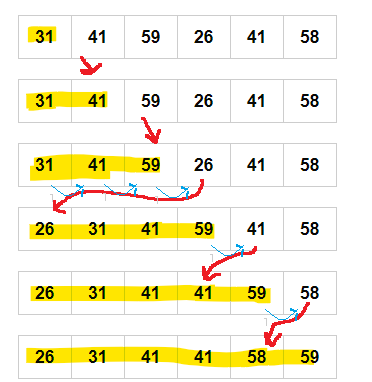

# Exercise - 2.1

***1. Illustrate the operation of INSERTION-SORT on the array A = [31, 41, 59, 26, 41, 58]***




---

***2. Rewrite the INSERTION-SORT procedure to sort into nonincreasing instead of nondecreasing order.***

***Pseudo Code***

```
insertion_sort_reverse(A):
    for j = 2 to A.length
        key = A[j]
        // Insert A[j] into sorted sequence A[1 .. j-1]
        i = j-1
        while i > 0 and A[i] < key:
            A[i+1] = A[i]
            i = i-1
        A[i+1] = key
```

[Insertion Sort Descending in Java](https://github.com/pctablet505/CLRS/blob/532c6f6b32f533115a34065e7b19cec67d5a88c9/Foundations/2%20-%20Getting%20Started/exercises/2.1/InsertionSortDescending.java)

[Insertion Sort Descending in Python](https://github.com/pctablet505/CLRS/blob/master/Foundations/2%20-%20Getting%20Started/exercises/2.1/Insertion%20Sort%20Descending.py)


---
***3. Write pseudocode for linear search, which scans through the sequence, looking for val. Using a loop invariant,
prove that your algorithm is correct. Make sure that your loop invariant fulfills the three necessary properties.***

[Linear Search](https://github.com/pctablet505/CLRS/blob/532c6f6b32f533115a34065e7b19cec67d5a88c9/Foundations/2%20-%20Getting%20Started/exercises/2.1/LinearSearch.java)

---
***4. Consider the problem of adding two n-bit binary integers, stored in two n-element arrays A and B. The sum of the
two integers should be stored in binary form in an (n + 1)-element array C. State the problem formally and write
pseudocode for adding the two integers.***

[Add Numbers](https://github.com/pctablet505/CLRS/blob/532c6f6b32f533115a34065e7b19cec67d5a88c9/Foundations/2%20-%20Getting%20Started/exercises/2.1/AddNumbers.java)

---
